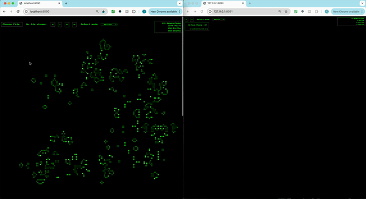
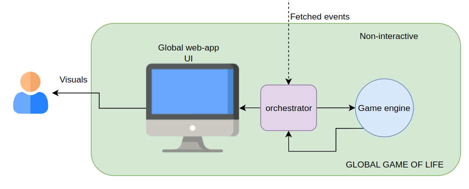

# Federated-Game-Of-Life

Conways game of life with flavour of SyftBox




## Table of Contents

- [Federated-Game-Of-Life](#federated-game-of-life)
  - [Table of Contents](#table-of-contents)
  - [Introduction](#introduction)
  - [Features](#features)
  - [How It Works](#how-it-works)
    - [Data Flow](#data-flow)
    - [API Operation Cycle](#api-operation-cycle)
      - [For GLOBAL GoL (non-interactive and visual)](#for-global-gol-non-interactive-and-visual)
  - [Getting Started](#getting-started)
    - [Prerequisites](#prerequisites)
    - [Installation](#installation)
      - [1. Install SyftBox](#1-install-syftbox)
      - [2. Set Up the Fed-GoL](#2-set-up-the-fed-gol)
  - [Usage](#usage)
    - [Accessing the Web Interface](#accessing-the-web-interface)
  - [Contributing](#contributing)
  - [License](#license)
  - [Acknowledgments](#acknowledgments)

## Introduction
Heard of Conways Game of life?
If no, watch this [Game of Life](https://www.youtube.com/watch?v=R9Plq-D1gEk).
Now, that you are ready to dive, behold another surprise. Ever wondered what would happen if images are states for GoL?
Welcome to the Federated version of famous Conways game of life. This is a federated playground where you can interact with available peers in creating beautiful Game-of-life states and see them unfold across time. We add an additional feature on top of conventional GoL, instead of states being random, you can use any image as a state guided by mouse-clicks for positional placements.

## Features

- **Decentralized Architecture**: Eliminates dependency on a central server; every participant runs the API locally.
- **Interactive GUI**: A simple and intuitive GUI for uploading and interacting your favourite images. 
- **Local and Global View**: To maintain simplicity of use and reducing cluttering, we have segregated the UI in a local (interactive and visual) and global (non-interactive but visual) view.
- **Automated Processing**: The API automatically aggregates info for every participant over the network.
- **SyftBox Integration**: Leverages SyftBox's privacy controls and synchronization capabilities.

## How It Works



1. Only visuals which supports changing color.
2. Dependent of [Local Game-of-Life setup](https://github.com/siddhant230/Fed-GoL)

### Data Flow

Each participant's SyftBox directory structure includes:

`datasites/<your_email>/api_data/fed_gol`

- _**`images/`**_: Folder from where the API fetches the processed uploaded images.
- _**`events/`**_: Folder from where the API fetches the generated events.

### API Operation Cycle

#### For GLOBAL GoL (non-interactive and visual)
1. Every 10 seconds, information (images and events) is fetched from `datasites/<your_email>/api_data/fed_gol`.
2. It is then placed over global canvas given the events (image-name and clicked positions).
3. Enjoy the visuals.

## Getting Started

### Prerequisites

- _**Operating System**_: MacOS or Linux.
- _**SyftBox**_: Installed and set up on your machine.

### Installation

#### 1. Install SyftBox

SyftBox is required to run the Fed-GoL API. Install it by running the following command in your terminal:

```bash
curl -LsSf https://syftbox.openmined.org/install.sh | sh
```

For more information, refer to the [SyftBox Documentation](https://syftbox-documentation.openmined.org/).

#### 2. Set Up the Fed-GoL

After installing SyftBox:

• **Option A: Using Git**

Navigate to your `SyftBox/apis/` directory and clone the Fed-GoL API repository:

```bash
cd ~/Desktop/SyftBox/apis

git clone https://github.com/siddhant230/Fed-GoL-global.git
```

• **Option B: Download ZIP**

1. Click below to download the ZIP file of the repository: [Download Repository](https://github.com/siddhant230/Fed-GoL-global/archive/refs/heads/main.zip)
2. Extract the ZIP file.
3. Move the extracted fed-GoL folder into the `SyftBox/apis/` directory.

SyftBox will automatically detect and install the new API during its execution cycle.

• **Dont forget to setup local interface**
use this : https://github.com/siddhant230/Fed-GoL


## Usage

### Accessing the Web Interface

1. **Open in Browser**: Paste the URL (http://127.0.0.1:8091/) into your browser’s address bar to access the fed-GoL interface. Global GUI runs by default on port 8091.

## Contributing

We welcome contributions to enhance the Fed-GoL API:

1. **Fork the Repository**: Click "Fork" on GitHub to create your copy.
2. **Create a Branch**: Develop your feature or fix in a new branch.
3. **Submit a Pull Request**: Provide a detailed description for review.

## License

NA

## Acknowledgments

• **SyftBox**: For providing the platform enabling decentralized applications.
• **GameOfLife**: [Numberphile](https://www.youtube.com/watch?v=R9Plq-D1gEk) | [The Coding train](https://www.youtube.com/watch?v=FWSR_7kZuYg)
• **Floyd-Steinberg Dithering**: [The Coding train](https://www.youtube.com/watch?v=0L2n8Tg2FwI)
• **OpenMined Community**: Thank you to everyone who has contributed to this project during the [30DaysOfFLCode](https://30daysofflcode.com/) challenge!